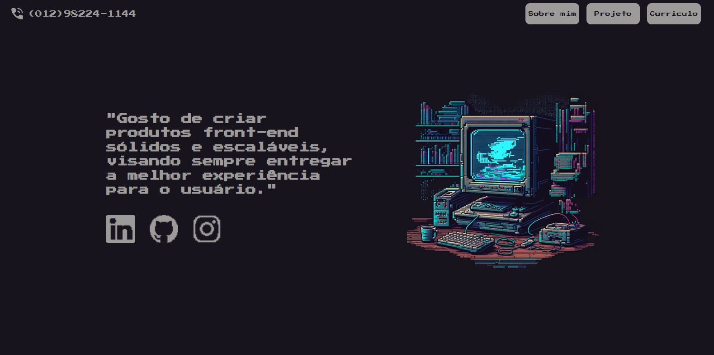
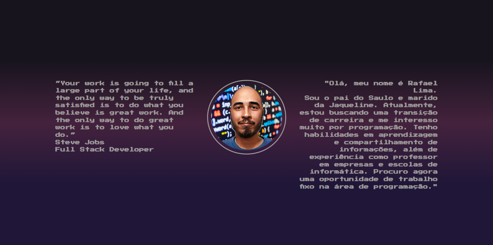
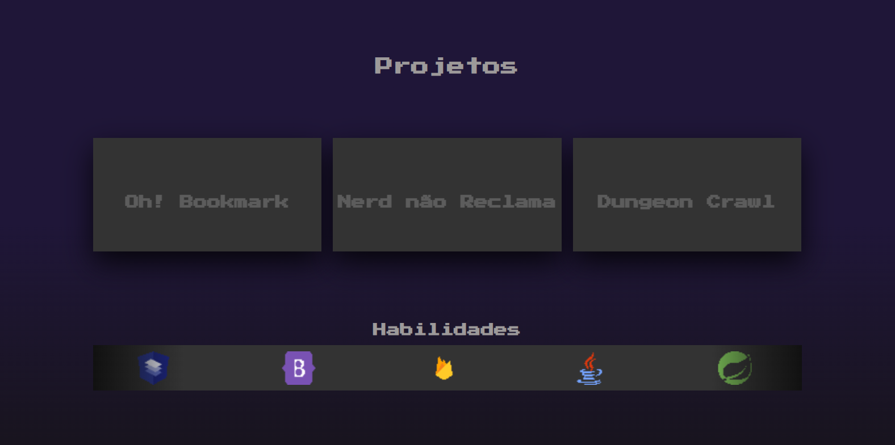
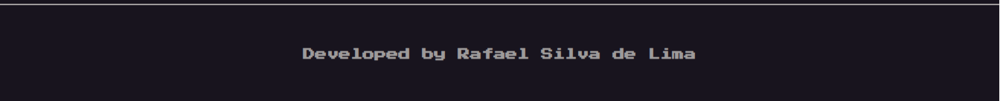

# Portifolio Rafael Silva de Lima
  Este é o projeto do meu portfólio e embora ainda esteja em seus estágios iniciais, com muitos pontos a melhorar, ele já está funcional. Por esse motivo, o projeto já está em deploy. Então, não perca tempo e embarque nessa viagem!
  [Clique aqui para acesso o portifolio](https://rafaelsilvadelima.github.io/portifolio_rafael_silva_de_lima/).
  
  ## Temática
  Como vocês podem perceber, eu escolhi um estilo retrô de jogos com uma abordagem de 8 bits e pixel art. Como eu amo jogos e, de certa forma, eles estão ligados à programação (como pode atestar meu projeto de jogo 2D rs), decidi incorporar essa característica que é importante para mim em minha apresentação.
  
  ## UI/UX
  ### Desktop
  Início
  
  Sobre mim
  
  Projetos
  
  Projetos com o card aberto
  
  footer
  
  
  Mobile
  

  
  
  
  
  ### Clique na imagem para iniciar o gif :
  
  

  
  ### Curriculo
  Ao clicar no botão na barra de navegação superior, é possível acessar uma página que contém um arquivo em formato JPG do meu currículo. No entanto, no futuro, o plano é criar essa página usando código.
  
  
