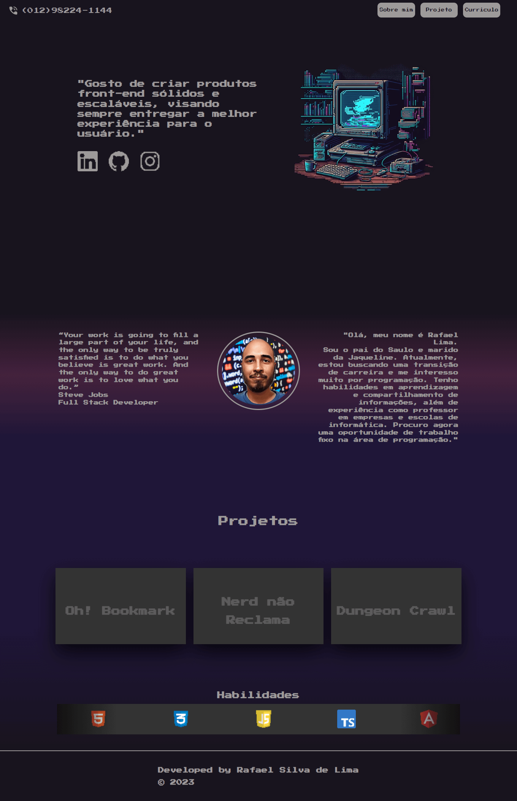

# Portifolio Rafael Silva de Lima
  Este é o projeto do meu portfólio e embora ainda esteja em seus estágios iniciais, com muitos pontos a melhorar, ele já está funcional. Por esse motivo, o projeto já está em deploy. Então, não perca tempo e embarque nessa viagem!
  [Clique aqui para acesso o portifolio](https://rafaelsilvadelima.github.io/portifolio_rafael_silva_de_lima/).
  
  ## Temática
  Como vocês podem perceber, eu escolhi um estilo retrô de jogos com uma abordagem de 8 bits e pixel art. Como eu amo jogos e, de certa forma, eles estão ligados à programação (como pode atestar meu projeto de jogo 2D rs), decidi incorporar essa característica que é importante para mim em minha apresentação.
  
  ## UI/UX
  ### Desktop
  Início
  
  
  ## Mobile
  
  
  ### Clique na imagem para iniciar o gif
  
  

   ## Software, framework e outros usados no processo de desenvolvimento.

 O Layout/UX inicial foi realizado no site [FIGMA](https://www.figma.com/).

 O fluxograma foi feito no site [Diagrams](https://www.diagrams.net/).

 O projeto está sendo desenvolvido no framwork [HTML](https://developer.mozilla.org/pt-BR/docs/Web/HTML).

 A parte de armazenamento, banco de dados assim como a authenticação de usuário está construida com [CSS](https://developer.mozilla.org/pt-BR/docs/Web/CSS).

 Linguagem de programação mais utilizada foi [Javascript](https://www.javascript.com/)

 Projeto está em seu processo inicial, então futuramente irei preparar para vocês um "readme" mais detalhado. Desde já, grato!
